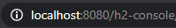
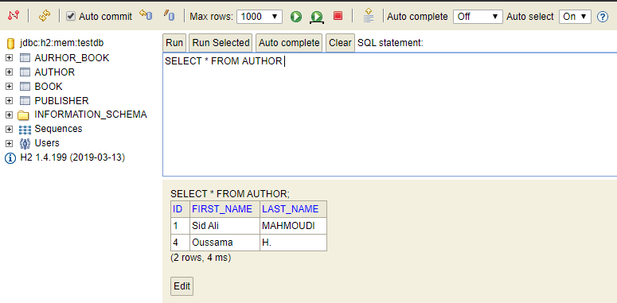
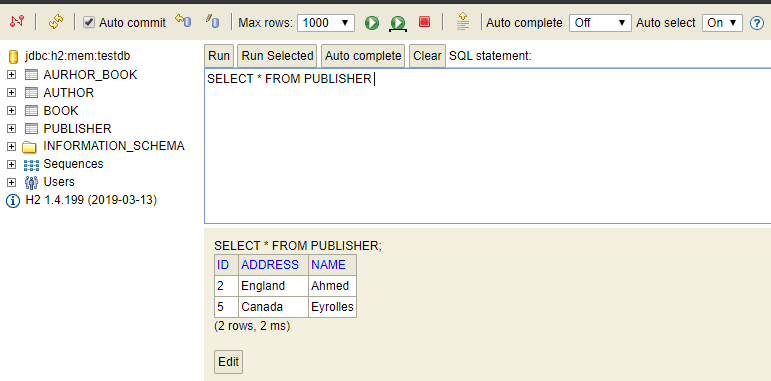
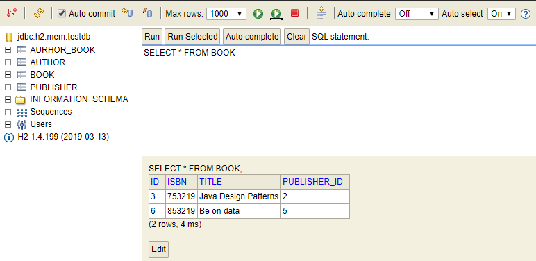

# Spring5WebApp
Developping new basic spring 5 web application using **starter data JPA**, **H2 data base** (in memory db) 
and the **ApplicationListener** interface for inserting data while the application starting.

- To populate data while the app start you should create a class that implents the ```ApplicationListener<ContextRefreshedEvent>```.

- To visualize the content of the **H2 db** after running the app, you should enter the url this url in your browser:
a
  and then the *JDBC URL* should be ``` jdbc:h2:mem:testdb ```.

- Here you can see the result when running our app :

    - Authors list:




     - Publishers list:




     - Books list:


